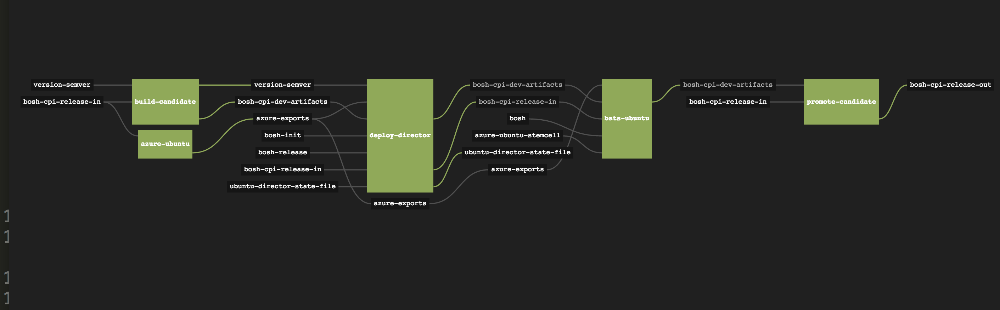

---
layout: post
title:  "Containerized CI with Concourse on Azure"
author: "Steven Edouard & Rita Zhang"
author-link: "http://www.stevenedouard.com;http://ritazh.com"
date:   2015-08-30 10:00:00
categories: Azure DevOps CI Concourse Cloud Foundry BOSH
color: "blue"
excerpt: "A Real-World Use Case of Containerized CI"
---

### What's Concourse?

[Concourse CI](http://concourse.ci) is a unique CI application where the concept of Pipelines is first class throughout the entire process. Concourse allows you to create more complex build systems through a series of input and output resources with each step defined by a task manifest and running in its own container.

The real advantages to Concourse are the out of the box support of containerized pipeline steps which prevents any kind of configuration pollution between steps as well as its ability to deploy highly scalable solutions suitable for large application development.

### The Problem

You may have heard of the [recent announcement of Cloud Foundry Support on Microsoft Azure](). Cloud Foundry is an open source PaaS that is deployed by a deployment managmenet tool called [BOSH](https://bosh.cloudfoundry.org/). BOSH works by using Cloud Platform Integration (CPI) packages to handle the IaaS details of each cloud provider. In order to have Cloud Foundry on Azure, you need to be able to support BOSH deployments on Azure which requires an Azure CPI package.

Since Cloud Foundry is used by some of the largest enterprises in the world, it's essential to support a Continuous Integration process for the CPI package to ensure further code changes to the CPI won't regress future Cloud Foundry deployments on Azure. 

The kind of testing needed for the CPI package needs to be quite exhaustive and must be end to end. In order to do this, we need to support the following Continuous Integration Steps:

- Build the CPI Package
- Deploy the Initial Azure Infrastructure for BOSH
- Deploy the BOSH Director with the Azure CPI Package
- Run the Bosh Acceptance Test Suite Against the Bosh Director
- Publish the Passed Build to a git Branch

We partnered with Pivotal, the maintainers of Cloud Foundry, to create a CI pipeline that can test the CPI's functionalities with high confidence. This enables the open source Cloud Foundry community with continuous updates for Cloud Foundry on Azure as well as support for enterprises who are using Cloud Foundry on Azure to deploy applications and services.

### The Solution

Because the build process required is quite complex, with very distinct parts, we decided to use [Concourse CI](https://concourse.ci) to automate the build with a series of well-defined, containerized, and isolated steps. This isolation means that system changes made in one container won't "pollute" settings in another container allowing for a clean and well-known state at each build step.

#### Concourse Resources

Between each step, all state of the build is stored off into [Concourse Resources](http://concourse.ci/implementing-resources.html), which can be anything from a [git repository](https://github.com/concourse/git-resource), a [semantic version number](https://github.com/concourse/semver-resource), to an [S3 Bucket](https://github.com/concourse/s3-resource). Resources are used as inputs and outputs between each step allowing each concourse `Task` to "connect" to one another by taking the output of one task and feeding it as the input to another. Concourse Resources implement an interface specification which allows for it to be used by Concourse CI.

A Concourse deployment can run locally using Vagrant and can be deployed to any infrastructure that supports BOSH. In the spirit of dogfooding, we deployed Concourse to Azure using the very same Azure CPI package we are testing. This allowed us to actually use the CPI as well as test it in an automated fashion.

Concourse does a great job at visualizing your build pipeline using an easy-to-understand block diagram with resources and build tasks connected via input and output lines. This easily allows you to see the realtime status of your build and to re-run any discrete step.

You can see the Bosh Azure CPI Release CI Pipeline below. It is composed of 5 discrete and isolated tasks.



Each black block with lines coming in and out is a Concourse Resource, and each green block is a [Concourse Task](http://concourse.ci/running-tasks.html). The entire pipeline is described by a YAML file, which describes each task as well as its input and output resources. If you're curious about the details of this pipeline as defined by its YAML, you can checkout the [actual CI pipeline YAML file here](https://github.com/sedouard/bosh-azure-cpi-release/blob/master/ci/pipeline.yml).

#### Build Tasks

If you look closer at our CI pipeline definition, you will notice our [CI tasks refer to a Docker image](https://github.com/sedouard/bosh-azure-cpi-release/blob/master/ci/tasks/run-bats.yml#L3).

##### Container
As we mentioned earlier, each build step is executed in its own container, specified by a container hosted in a Docker registry. Concourse actually runs containers with [garden-linux](https://github.com/cloudfoundry-incubator/garden-linux), which is compatible with [Open Container Specification](https://www.opencontainers.org/) images. For all intents and purposes, this is an implementation detail and your container will run exactly as you would expect it to run if you ran it with Docker.

To understand details about that container, let's take a look at [our image repository](https://hub.docker.com/r/sedouard/azure-cpi-release/).

##### Build task definition
Build tasks are defined by a simple YAML structure similar to this:

```YAML
---
platform: linux
image: docker:///sedouard/azure-cpi-release
**Inputs:**
  - name: bosh-cpi-release
  - name: version-semver
run:
  path: bosh-cpi-release/ci/tasks/build-candidate.sh

```

This definition contains several key components for this build task:

- Reference to the Docker image to use for this step
- Inputs to use that are described in the main pipeline's YAML file
- Reference to the script file to execute in this step

Below are quick overviews of each build step, what it does, and what it produces. A link is provided to the actual definition in code for each step.

###### [Build-Candidate](https://github.com/sedouard/bosh-azure-cpi-release/blob/master/ci/tasks/build-candidate.yml)

**Inputs:**

- **version-semver** - The semantic version of this build
- **bosh-cpi-release-in** - The git repository of the CPI to create the BOSH release from

**What it does:**

Builds the BOSH release candidate using a [series of standard steps](https://github.com/sedouard/bosh-azure-cpi-release/blob/master/ci/tasks/build-candidate.sh) specific to creating a BOSH release.

**Outputs:**

- **bosh-cpi-dev-artifacts** - The current BOSH release tarball
- **version-semver** - The same semantic version of the build passed as an input

###### [Azure-Provision](https://github.com/sedouard/bosh-azure-cpi-release/blob/master/ci/tasks/azure-provision.yml)

**Inputs:**

- **version-semver** - The semantic version of this build
- **bosh-cpi-release-in** - The git repository of the CPI to create the BOSH release from

**What it does:**

Provisions the basic azure infrastructure required to deploy BOSH-managed infrastructure on Azure. This mainly includes a VNet, two subnets, a resource group, a storage account, and two public IP addresses. All the gritty details of how we extract the deployment information from Azure using the [CLI](https://npmjs.org/azure-cli) can be found in this task's [shell script](https://github.com/sedouard/bosh-azure-cpi-release/blob/master/ci/tasks/azure-provision.sh).

**Outputs:**

- **azure-exports** - A generated script file that includes the public IP addresses to use for Cloud Foundry and the BOSH director. This also includes specific details on connecting to the created Azure Storage account

###### [Deploy-Director](https://github.com/sedouard/bosh-azure-cpi-release/blob/master/ci/tasks/deploy.yml)

**Inputs:**

- **bosh-cpi-dev-artifacts** - The current BOSH release tarball
- **version-semver** - The same semantic version of the build passed as an input
- **azure-exports** - A generated script file that includes the public IP addresses to use for Cloud Foundry and the BOSH director
- **bosh-init** - The bosh-init tarball for Linux
- **bosh-release** - The BOSH release tarball to use for the director
- **bosh-cpi-release-in** - The git repository of the CPI to create the BOSH release from
- **ubuntu-director-state-file** - A file that records the current deployment state of the director - to enable re-runs by deleting and reprovisoning the director on the same azure resource group deployment

**What it does:**

Uses the `bosh-init` CLI to deploy a rendered [manifest file template](https://github.com/sedouard/bosh-azure-cpi-release/blob/master/ci/tasks/deploy.sh#L46) that describes the virtual machines and networking infrastructure to have a BOSH director capable of deploying BOSH releases.

The `deploy-director` step uses the `azure-exports` input file created as a result of the completion of the `azure-provision` step. With the `azure-exports` input file, the public IP address of the VM provisioned in the previous step is automatically injected. The same VM will be used to provision the BOSH director.

**Outputs:**

- **ubuntu-director-state-file** - The state file that represents the current deployment state of the director. Used by any future re-runs of the `Deploy-Director` step.
- **bosh-cpi-dev-artifacts** - The current BOSH release tarball - passes this along from the input
- **bosh-cpi-release-in** - The git repository of the CPI to create the BOSH release from - passes this along from inputs

###### [Run-Bats](https://github.com/sedouard/bosh-azure-cpi-release/blob/master/ci/tasks/run-bats.yml)

**Inputs:**

- **azure-exports** - A generated script file that includes the public IP addresses to use for Cloud Foundry and the BOSH director
- **azure-ubuntu-stemcell** - The base image to use for VMs of any BOSH deployment on Ubuntu. This includes the VM agent for Azure.
- **bosh** - The official BOSH Repo - used to run BATs
- **bosh-cpi-dev-artifacts** - The current BOSH release tarball
- **bosh-cpi-release-in** - The git repository of the CPI to create the BOSH release from

**What it does:**

Runs the standard set of BOSH Acceptance Tests (BATs) against the BOSH director. This runs a series of steps such as `bosh deployment`, `bosh deploy`, verification of the state of the BOSH director, and verification of deployments after each command. This task is triggered by the successful completion of the [Deploy-Director](https://github.com/sedouard/bosh-azure-cpi-release/blob/master/ci/tasks/deploy.yml) task.

**Outputs:**

- **bosh-cpi-dev-artifacts** - The current BOSH release tarball - passed along from input
- **bosh-cpi-release-in** - The git repository of the CPI to create the BOSH release from - passed along from input

###### [Promote Candidate](https://github.com/sedouard/bosh-azure-cpi-release/blob/master/ci/tasks/promote-candidate.yml)

**Inputs:**

- **bosh-cpi-dev-artifacts** - The current BOSH release tarball - passes this along from the input
- **bosh-cpi-release-in** - The git repository of the CPI to create the BOSH release from - passes this along from inputs

**What it does:**

Promote Candidate will be triggered by a sucessful completion of the [Run-Bats](https://github.com/sedouard/bosh-azure-cpi-release/blob/master/ci/tasks/run-bats.yml) task. It will take the current target git branch within `bosh-cpi-release-in`, deploy the promoted build of the CPI to S3, and publish the current state of the branch to a new release branch. You can check out the detailed steps in the [shell script](https://github.com/sedouard/bosh-azure-cpi-release/blob/master/ci/tasks/promote-candidate.sh).

## A Complete End to End CI System

The above steps comprise the full end-to-end pipeline steps that are required to validate the Azure CPI similarly to how an end user would use it.

Pivotal will continue to use this pipeline to support the Azure CPI and BOSH deployments on Azure. If you're wondering how you can use BOSH to deploy Cloud Foundry on Azure, [you should head over to our post about that topic](http://the-post-about-CF-on-azure).

## Getting Started with Concourse CI

The great thing about this collaboration is that **you too** can create a scalable, CI system thats completely open source. We have [collaborated](https://github.com/concourse/concourse/pull/174) with the Concourse CI maintainers to create [the official Azure Documentation for Concourse CI](http://concourse.ci/setting-up-the-infrastructure.html#azure).

These instructions will walk you through creating your own infrastructure, BOSH director, and deploying Concourse to Azure IaaS. You'll be able to scale this deployment with as many VMs as you need for your CI workload needs.
